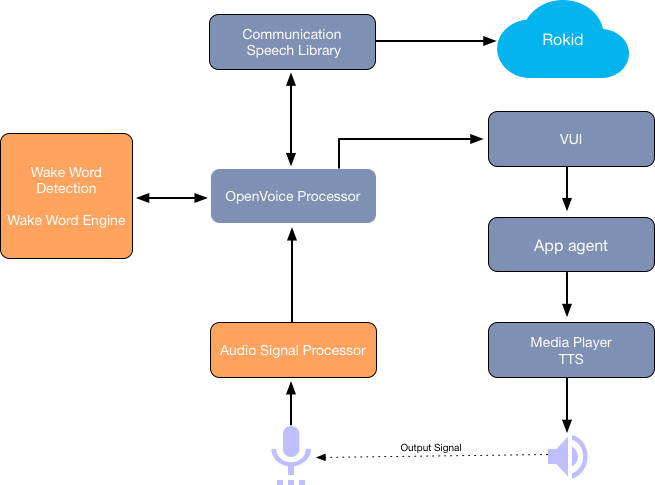

# RokidOS 源代码

RokidOS 是一个针对多种不同设备类型打造的开放源代码以语音交互为特色的软件堆栈。RokidOS 主要目的是为运营商、设备制造商、DesignHouse 和开发者创造一个开放的软件平台，使他们能够将创新理念变为现实，并推出能够卓有成效地改善用户移动体验的真实产品。

## 系统架构图

## 语音数据流示意图

## 系统特性
* **Linux Native Services**
	* **systemd** Linux Init System - systemd 管理各种服务进程
	* **PulseAudio** 提供Audio服务及路由机制

* **Rokid Openvoice SDK**
	* **Speech SDK** 封装了与Rokid云服务交互协议，包括ASR、NLP、TTS等云端服务
	* **Blacksiren SDK** 输入麦克风数据，经内部拾音算法及云端服务（调用SpeechSDK），输出语音识别结果、各种拾音事件

* **Rokid System上的基础组件**
	* **媒体播放库** 提供媒体播放功能
	* **Android Binder** 提供Android系统进程间通讯机制
	* **Android HAL** 提供Android HAL功能
		* Android HAL 移植到Linux系统，方便实现Mic Array，Led Array，Sensor等

* **Rokid System Services/Framework**
	* **OpenvoiceProc Service** 将Blacksiren封装成服务，维护拾音、唤醒、云端识别解析业务的状态
	* **Application Manager Service** Rokid语音应用的生命期调度、事件分发框架
	* **Openvoice App Zygote** 由该进程负责启动所有语音应用
	* **系统音量控制** 提供系统的音量控制服务
	* **Input Service** 提供按键、触摸、鼠标事件服务
	* **TtsFlinger Service** 提供设备端的语音转文字服务
	* **LumenFlinger Service** 提供灯光渲染服务
	* **BtFlinger Service** 提供蓝牙功能
	* **系统电量服务** 系统电量服务
	* **应用包管理** 应用安装升级
	* **OTA** 系统升级
	* **蓝牙配网服务** 通过蓝牙BLE来配置Wifi网络

* **Rokid Node.js Runtime**

* **Rokid System Apps**
	* **CloudAppAgent** 云应用通用客户端
		* 支持天气、新闻、音乐、聊天、百科等云应用
	* **灯光寻向指示**
	* **蓝牙音乐应用**

* **调试开发工具**
	* **Android ADB** 提供ADB支持，方便开发
	* **手机端蓝牙配网应用** 提供手机端配网及相关功能

